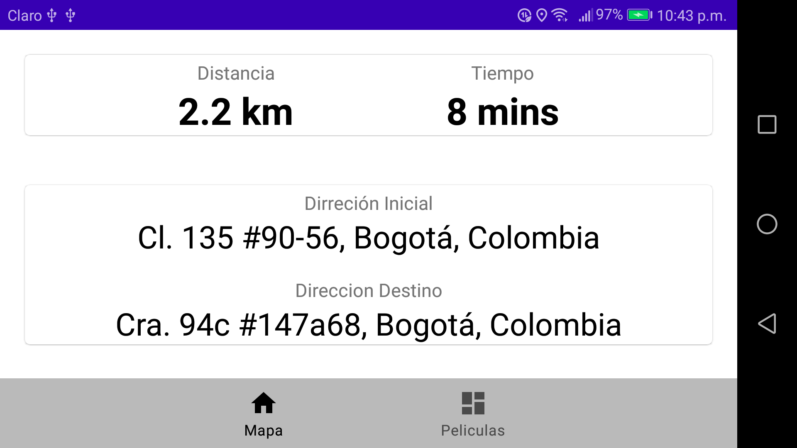

**➢ Requerimientos técnicos para construir el proyecto.**
* Android Studio 4.2.1
* Java JDK 11

**➢ Breve descripción de la responsabilidad de cada capa propuesta.**

* Propuesta Mapa
  Para visualizar la ubicación del usuario debe aceptar los permisos que solicita la app en tiempo de ejecución.
* Propuesta Películas
  Muestra un listado de películas y cuando de click sobre una película puede obtener más información y detalle.

**➢ Screenshots que visualice las vistas solicitadas.**
<!--  -->

  
  
  
  
  
  

